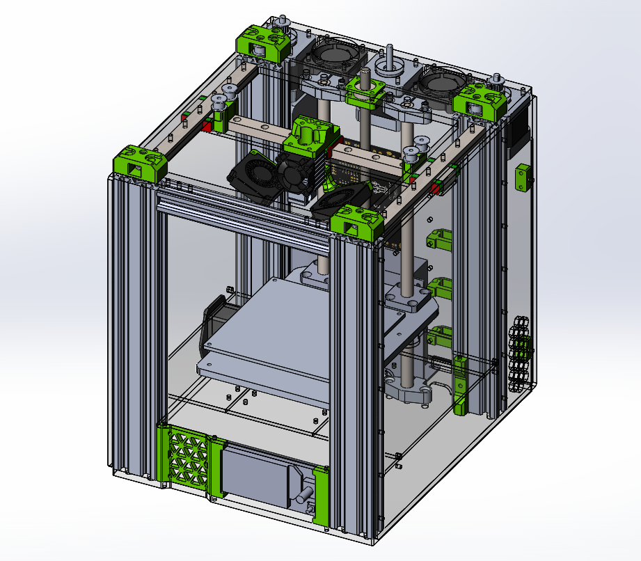

# GBot-Tiny-Mark-II

Это вторая версия моего первого принтера GBot Tiny. Новый принтер теперь чуточку компактней по XY, но выше, при этом зона печати стала слегка больше.  

## Обзор конструкции
Рама теперь состоит из профиля 2040. Из-за того, что рама стала меньше, она стала жёстче. Первая версия не имела отсека под электронику, новая - целых два (легкодоступный под столиком и сзади). Материнскую плату и блок питания предполагается ставить сзади. Таким образом можно добиться максимально компактной компановки и "подключать движки проводами 10см". Я для себя буду собирать принтер на клиппере, поэтому в переднем отсеке прекрасно разместится одноплатный компьютер со своим блоком питания или понижающим преобразователем.

## Примечание
В папке [CAD] вы найдёте актуальные модели для производства данного принтера. [DXF] - для лазерной резки, [STL] - для печати. В этих папках лежат детали с минимальным риском изменения. Остальные детали всегда можно взять из актуальной step-сборки принтера из папки [STEP].

[CAD]: https://github.com/gotchau/GBot-Tiny-Mark-II/tree/main/CAD
[DXF]: https://github.com/gotchau/GBot-Tiny-Mark-II/tree/main/CAD/DXF
[STL]: https://github.com/gotchau/GBot-Tiny-Mark-II/tree/main/CAD/STL
[STEP]: https://github.com/gotchau/GBot-Tiny-Mark-II/tree/main/CAD/STEP
