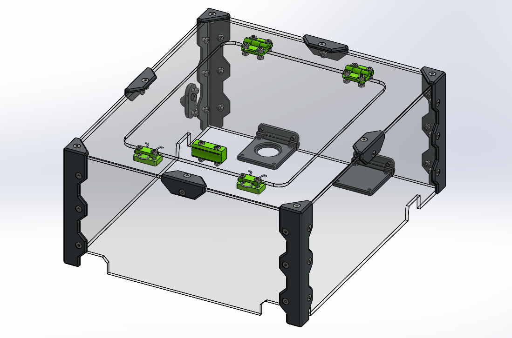

# Купол Tiny Mark II

## Внешний вид

Купол состоит из 5 панелей вырезанных из акрила 3мм, которые скрепляются с помощью печатных уголков. Пруток с пластиком заводится во внутрь по боудену через штуцер на боковой стенке. Жгут проводов до печатной головы идёт сквозь отверстие одной из петель. Спроектировано под разъем GX20. Петли крепятся на места вентиляторов отсека электроники. Отказ от них не критичен. У меня отсек работает всегда в пассивном режиме. 

Файлы STL и DXF находятся в соответствующих папках.

В папке **assets** есть несколько видео того, как это выглядит уже в собранном виде.

## Благодарности

Данный купол появился на свет благодаря активности сообщества. Большое спасибо Алексею.